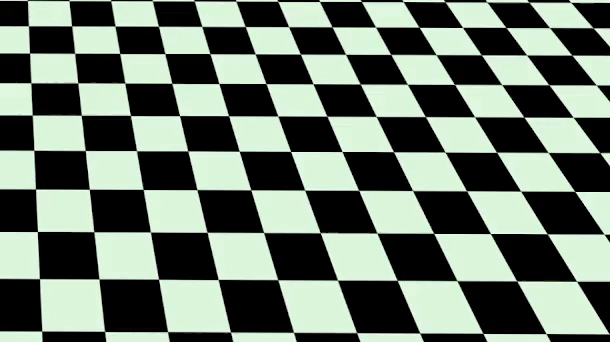

# TD3 for [Ant_v4](https://www.gymlibrary.dev/environments/mujoco/ant/)

The ant is a 3D robot with four legs and each leg has two links. The goal is to coordinate the four legs to go forward by applying torques on the eight hinges connecting the two links of each leg and the torso. this environment is in Gym library and its part of the [Mujoco environments](https://www.gymlibrary.dev/environments/mujoco/).

## Intriduction to TD3 algorithm

Twin Delayed DDPG (TD3) is one of the Deep Reinforcement Learning algorithms, which is developed to overcome some of difficalties in the DDPG algorithm such as the Critic overestimation problem. To explain more, TD3 is a combination of several state-of-the-art concepts and methods like ActorCritics, Deep Q-Learning, and policy gradient. Research and comparisons have illustrated that utilizing this algorithm results in higher rewards compared to other algorithms like DDPG. In this work, TD3 has been used to train an ant robot as an agent to run across a field as the environment. TD3 has been implemented in this work and rewards have shown promising results and have proven its excellence.

## Methodology([Fujimoto et al.](https://arxiv.org/abs/1802.09477))

The first step is to initialize the Experience Replay Memory with a size of 20000, which will then be populated with each new transition. Then two fully connected neural networks were built for both the Actor model and the Actor Target model with the same structure of two hidden layers, in which the weights are initialized randomly. Then four fully connected neural networks were built for the two Critic models and the two Actor target models with the same structure of two hidden layers, in which the weights are initialized randomly as well.

After that, the program will be executed for $m$ episodes and in each episode, the environment will run for a certain amount of time steps. For each time step, the state $s$ of that moment in the simulation is fed to the Actor model, and the output is an action $a$ that will be executed in the simulation. By executing actions in the environment, we obtain the next state $s’$ and a reward $r$ for that state and action. Transitions of $(s, a, s’, r)$ are saved in Experience Replay Memory for each timestep and the training of the models will be started after collecting about 10000 data. By Sampling a batch of 100 transitions $(s, s’, a, r)$ from the memory, we can now start to train our models for each element of the batch. At first, from the next state $s’$, the Actor target plays the next action $a’$. Then the Gaussian noise is added to this next action $a’$ and clamped in a range of values supported by the environment. The two Critic target networks take each of the concatenated couples of $(s’, a’)$ as input and return two Q-values $Q_{t1}(s’, a’)$ and $Q_{t2}(s’, a’)$ as outputs. After that, the final Qt is calculated as:

$$Q_t = r + \gamma * min(Q_{t1},Q_{t2})$$

Where $\gamma$ is a discount factor. It should be mentioned that the minimum Q-values are important because the critic models had an overestimation problem in DDPG. By using twin critic networks and choosing the small one we are now able to limit this issue. The critic loss for the two Critic networks is calculated as:

$$Loss = MSE_{Loss} (Q_1(s, a’), Q_t) + MSE_{Loss} (Q_2(s, a’), Q_t)$$

Where $Q_1(s, a)$ and $Q_2(s, a)$ are the outputs of two Critic models when they take each of the couple $(s, a)$ as input. Then by backpropagation of the Critic Loss, the parameters of the two Critic models will be updated by utilizing Stochastic Gradient Descent $SGD$ optimizer. Once every two iterations, we update the Actor model by performing Gradient Ascent on the output of the first Critic model:

$$\nabla _{\phi}J(\phi) = N^{-1} \sum \nabla_a Q_{\theta_1}(s,a)|_{a=\pi _{\phi}(s)}\nabla _{\phi} \pi_{\phi}(s)$$

Where $\phi$ and $\theta_1$ are the weights of the Actor and the first Critic respectively. And again, once at every two iterations, the weights of the Actor target and Critic targets will be updated by Polyak Averaging:

$$\theta_i' \leftarrow\ \tau \theta_i + (1-\tau) \theta_i'$$

$$\phi' \leftarrow\ \tau \phi + (1-\tau) \phi'$$

## Network Architecture and Parameters

Both actor and critic networks have 2 hidden layers with 400, 300 hidden units in each layer. Hidden layers use RELU activation function and the actor output layer uses tanh. The actor and critic networks both have 0.001 learning rate. The tau factor as is mentioned in Polyak averaging is 0.5 percent and the discount factor in calculation of Qt is 99 percent. Also, for choosing action after warm-up period base on the actor network output plus a random Gaussian noise of 0.2.

## Results

In the current research work, we have modeled and trained an intelligent agent to interact with a continuous environment to control an Ant robot joints in a special ordered to move it forward using the TD3 algorithm. First of all, we collect data by choosing random actions near the object to increase the probability of moving the object for 10,000 warm-up actions and we start the training as soon as we have enough data for 1 batch which is 100 iterations. The agent achieved an average reward of near zero after the exploration. After 500,000 iterations, a reward of over 5000 was achieved as can be seen in figure and the terminal output here.

<pre>
---------------------------------------
Average Reward over the Evaluation Step: 5150.995116
---------------------------------------
Total Timesteps: 475087 Episode Num: 718 Reward: 130.4707546846942
Total Timesteps: 476087 Episode Num: 719 Reward: 4744.758304930833
Total Timesteps: 477087 Episode Num: 720 Reward: 4598.6980177315045
Total Timesteps: 478087 Episode Num: 721 Reward: 5009.410919731876
Total Timesteps: 479087 Episode Num: 722 Reward: 4768.496530117281
Total Timesteps: 480087 Episode Num: 723 Reward: 4914.790169217006
---------------------------------------
Average Reward over the Evaluation Step: 5355.879049
---------------------------------------
Total Timesteps: 481087 Episode Num: 724 Reward: 4791.847266485013
Total Timesteps: 481384 Episode Num: 725 Reward: 1344.9876573480885
Total Timesteps: 482384 Episode Num: 726 Reward: 4883.872573549934
Total Timesteps: 482587 Episode Num: 727 Reward: 903.5324190466108
Total Timesteps: 483140 Episode Num: 728 Reward: 2692.3545879081366
Total Timesteps: 484069 Episode Num: 729 Reward: 4526.55167408945
Total Timesteps: 484141 Episode Num: 730 Reward: 166.7158366919194
Total Timesteps: 484779 Episode Num: 731 Reward: 3099.404926495981
Total Timesteps: 485219 Episode Num: 732 Reward: 2163.224383690062
---------------------------------------
Average Reward over the Evaluation Step: 4706.073903
---------------------------------------
Total Timesteps: 486219 Episode Num: 733 Reward: 4896.8946791597955
Total Timesteps: 487219 Episode Num: 734 Reward: 5060.00768519453
Total Timesteps: 488219 Episode Num: 735 Reward: 4968.298636309208
Total Timesteps: 489219 Episode Num: 736 Reward: 5064.8693546781005
Total Timesteps: 490219 Episode Num: 737 Reward: 4898.477814242005
---------------------------------------
Average Reward over the Evaluation Step: 5279.216627
---------------------------------------
Total Timesteps: 491219 Episode Num: 738 Reward: 4724.081945236845
Total Timesteps: 492219 Episode Num: 739 Reward: 5118.397272274108
Total Timesteps: 493219 Episode Num: 740 Reward: 5026.699063796929
Total Timesteps: 494219 Episode Num: 741 Reward: 5164.524917065917
Total Timesteps: 495219 Episode Num: 742 Reward: 5133.730951013225
---------------------------------------
Average Reward over the Evaluation Step: 4624.661732
---------------------------------------
Total Timesteps: 496170 Episode Num: 743 Reward: 4351.984667606855
Total Timesteps: 497170 Episode Num: 744 Reward: 4728.442942994709
Total Timesteps: 497424 Episode Num: 745 Reward: 1101.9940366247445
Total Timesteps: 498424 Episode Num: 746 Reward: 4795.561815518422
Total Timesteps: 499424 Episode Num: 747 Reward: 4880.445860926511
---------------------------------------
Average Reward over the Evaluation Step: 5090.040426
---------------------------------------
</pre>

